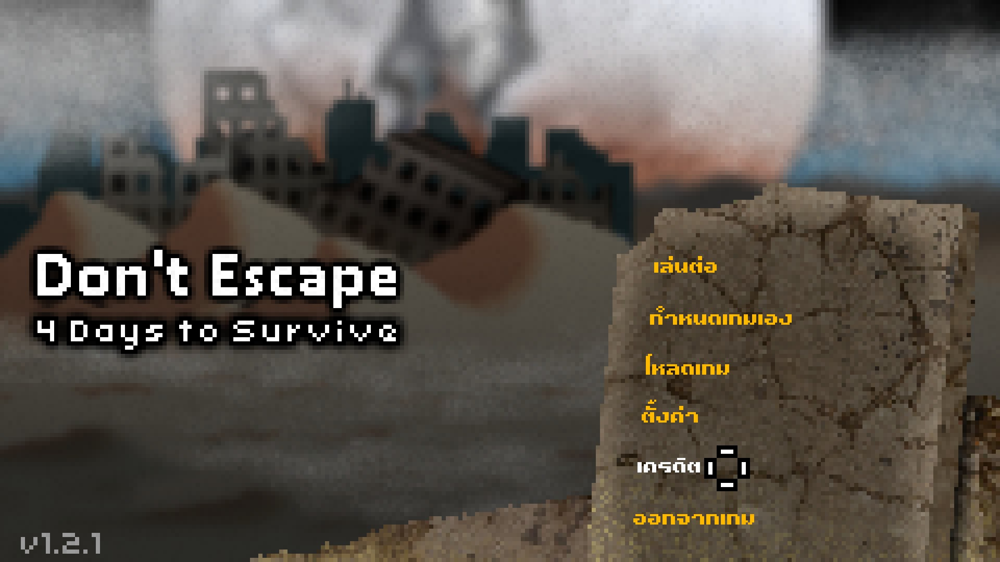
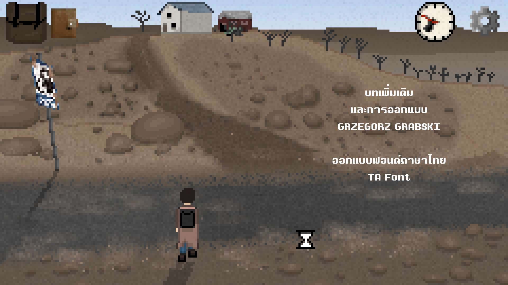

# Don't Escape: 4 Days to Survive — มอดภาษาไทย


มอดภาษาไทยสำหรับ **Don't Escape: 4 Days to Survive** ครอบคลุมเมนู UI บทสนทนา ไอเทม เอกสาร สมุดบันทึก ข้อความปริศนา New Game+ และข้อความในฉากจบ/เครดิตที่รองรับ พร้อมฟอนต์ไทยให้เลือก 2 รูปแบบ

> **เวอร์ชัน 1.0.1** — Hotfix สำหรับตำแหน่งข้อความไทยในหน้าจอโดรนก๊าซพิษ Day 1 ทั้งฟอนต์ Pixel และ Smooth

[](https://github.com/IsAmArt/Don-t-Escape-4-Days-to-Survive-Thai-MOD/releases/download/v1.0.1/DontEscape4Days_ThaiMod_v1.0.1.zip)
[](https://github.com/BepInEx/BepInEx/releases/download/v5.4.23.5/BepInEx_win_x86_5.4.23.5.zip)

[English README](README_EN.md)

## สถานะรุ่น

- Version: **1.0.1**
- Status: **Public Hotfix Release**
- Game: **Don't Escape: 4 Days to Survive** (ผู้ใช้ต้องมีเกมต้นฉบับอย่างถูกต้อง)
- Platform tested: **Windows**
- Mod loader: **BepInEx 5.4.23.5 x86**

## จุดเด่น

- แปลเนื้อหาและส่วนติดต่อหลักของเกมเป็นภาษาไทย
- สลับฟอนต์ไทยได้ระหว่าง **Pixel** และ **Smooth** จากเมนู Options
- ปรับการจัดวางภาษาไทยสำหรับเอกสาร สมุดบันทึก ป๊อปอัป และฉากเฉพาะหลายจุด
- รองรับเนื้อหาที่เกี่ยวข้องกับ New Game+ และฉากจบที่ตรวจพบระหว่างการทดสอบ
- เก็บโหมดวินิจฉัยสำหรับการแก้ปัญหาไว้ในสถานะปิดตามค่าเริ่มต้น

## ภาพตัวอย่าง

| เมนูตั้งค่า — Pixel | เมนูตั้งค่า — Smooth |
| --- | --- |
|  |  |

| ข้อความในเกม — Pixel | ข้อความในเกม — Smooth |
| --- | --- |
|  |  |

| เมนูหลัก — Pixel | เครดิตภาษาไทย |
| --- | --- |
|  |  |

## รูปแบบฟอนต์ภาษาไทย

- **Pixel** — เข้ากับภาพพิกเซลและบรรยากาศเดิมของเกม
- **Smooth** — เส้นตัวอักษรเรียบและอ่านง่ายขึ้น

สามารถสลับรูปแบบได้จาก **Options > Font** ขณะใช้ภาษาไทย
สามารถสลับภาษาไทย-อังกฤษได้

## สิ่งที่ต้องมี

- เกม **Don't Escape: 4 Days to Survive** สำหรับ Windows
- **BepInEx 5.4.23.5 รุ่น x86 เท่านั้น** — ห้ามใช้รุ่น x64

ตัวมอดไม่รวม BepInEx และไม่รวมไฟล์เกมต้นฉบับ

## ดาวน์โหลด

ดาวน์โหลดไฟล์ `DontEscape4Days_ThaiMod_v1.0.1.zip` จากปุ่มด้านบนหรือหน้า [Releases](https://github.com/IsAmArt/Don-t-Escape-4-Days-to-Survive-Thai-MOD/releases)

> อย่าดาวน์โหลดไฟล์ **Source code (zip)** หรือ **Source code (tar.gz)** ที่ GitHub สร้างให้อัตโนมัติ เพราะไฟล์เหล่านั้นไม่ใช่ชุดติดตั้งมอด

## วิธีติดตั้ง

1. แตกไฟล BepInEx 5.4.23.5 **x86** ลงในโฟลเดอร์หลักของเกมให้เรียบร้อย
2. เปิดเกม เมื่อถึงหน้าเมนูเริ่มเกม ให้ออกจากเกม 1 รอบ
3. เปิดไฟล์ `DontEscape4Days_ThaiMod_v1.0.1.zip`
4. คัดลอกโฟลเดอร์ `BepInEx` ภายใน ZIP ไปวางแทนที่โฟลเดอเดิม ในโฟลเดอร์หลักของเกม
5. เปิดเกม ไปที่ **Options > Language** แล้วเลือก **ภาษาไทย**
6. เลือก **Pixel** หรือ **Smooth** ที่หน้า **Options > Font** ตามต้องการ


โครงสร้างไฟล์หลักหลังติดตั้ง:

```text
BepInEx/
├─ config/
│  └─ tafo.dontescape4.thai.renderer.cfg
└─ plugins/
   └─ DontEscapeThaiMod/
      ├─ DontEscapeThaiMod.dll
      └─ ThaiData/
         ├─ Localization/
         ├─ Pixel/
         ├─ Smooth/
         └─ UI/
```

หากอัปเดตจากรุ่นเก่า ให้ปิดเกมก่อนแทนที่ไฟล์ของมอด ไม่ต้องลบไฟล์เซฟ

## ถอนการติดตั้ง

ปิดเกม แล้วลบเฉพาะ:

- `BepInEx/plugins/DontEscapeThaiMod`
- `BepInEx/config/tafo.dontescape4.thai.renderer.cfg`

ไม่ควรลบ BepInEx ทั้งโฟลเดอร์ เพราะมอดอื่นอาจใช้งานอยู่

## หมายเหตุ

มอดรุ่นนี้ผ่านการทดสอบเล่นจนจบและ QA ด้วยตัวผมเองแล้วในระดับหนึ่ง และไม่พบปัญหาระดับ blocker ในการทดสอบ v1.0.1
อย่างไรก็ตาม ยังมีจุดตัดบรรทัด ถ้อยคำ/บริบท หรือการจัดวางขนาดเล็กบางตำแหน่งที่ยังตกหล่น ยังต้องงปรับปรุงแก้ไขเพิ่มเติมต่อไปใน mod รุ่นต่อไป

## การแก้ปัญหา

### ไม่มีภาษาไทยในเมนู หรือ BepInEx ไม่โหลดมอด

- ตรวจอีกครั้งว่าใช้ BepInEx **x86** ไม่ใช่ x64
- ตรวจตำแหน่ง DLL และตรวจว่าโฟลเดอร์ `ThaiData` ถูกคัดลอกมาครบ
- หาก Windows บล็อก DLL ที่ดาวน์โหลด ให้เปิด Properties ของไฟล์และเลือกปลดบล็อกตามคำแนะนำของ Windows
- หากไม่พบภาษาไทยหรือเกมไม่โหลดมอด ให้แนบ `BepInEx/LogOutput.log` ในรายงานปัญหา โดยไม่ต้องเปิดโหมด diagnostics

### ตัวอักษรหรือ UI ผิดปกติ

เก็บภาพหน้าจอและจดตำแหน่ง/เหตุการณ์ในเกม รูปแบบฟอนต์ที่ใช้ (Pixel หรือ Smooth) และขั้นตอนที่ทำให้เกิดปัญหา

## แจ้งปัญหา / เสนอแก้คำแปล / ติดต่อพูดคุย
- เฟสบุค : https://www.facebook.com/ta.font.taweechai
- discord : https://discord.gg/u4gYPuajZ
- e-mail : isamart2530@gmail.com
- หรือแจ้งผ่าน [GitHub Issues](https://github.com/IsAmArt/Don-t-Escape-4-Days-to-Survive-Thai-MOD/issues) 
พร้อมระบุเวอร์ชันมอด เวอร์ชันเกม รูปแบบฟอนต์ ภาพหน้าจอ จุดหรือเหตุการณ์ในเกม ข้อความที่พบ และ `BepInEx/LogOutput.log` 
หากเป็นปัญหาระบบ ไม่จำเป็นต้องแนบไฟล์เซฟหรือข้อมูลส่วนตัว

## เครดิต

- Thai Translation / Thai Mod: **IsAmArt / TA Font**
- Thai Font: **TA Font**
- เกมต้นฉบับ: **Mateusz “Scriptwelder” Sokalszczuk** และผู้มีส่วนร่วมตามเครดิตภายในเกม
- ผู้จัดจำหน่ายเกม: **Armor Games Studios**

ดูรายละเอียดส่วนประกอบภายนอกที่ [THIRD_PARTY_NOTICES.md](THIRD_PARTY_NOTICES.md)

## สนับสนุนผลงานเพื่อต่อยอดพัฒนาฟอนต์และมอดเกมภาษาไทย


0493-9349-45 / ธ.กสิกรไทย / บัญชี นาย ทวีชัย อัศวรังสิตแสง

## หมายเหตุด้านสิทธิ์

มอดนี้จัดทำโดยแฟนเกมและไม่มีความเกี่ยวข้องอย่างเป็นทางการกับผู้พัฒนาหรือผู้จัดจำหน่ายเกม ไฟล์เกม ชื่อ และเครื่องหมายการค้าของเกมเป็นสิทธิ์ของเจ้าของแต่ละราย โปรดอ่านรายละเอียดสิทธิ์การใช้งานของโค้ดมอด งานแปล และฟอนต์ไทยใน [LICENSE.md](LICENSE.md)
