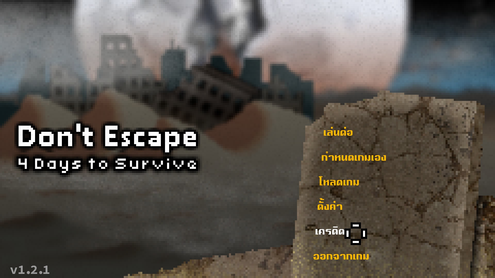
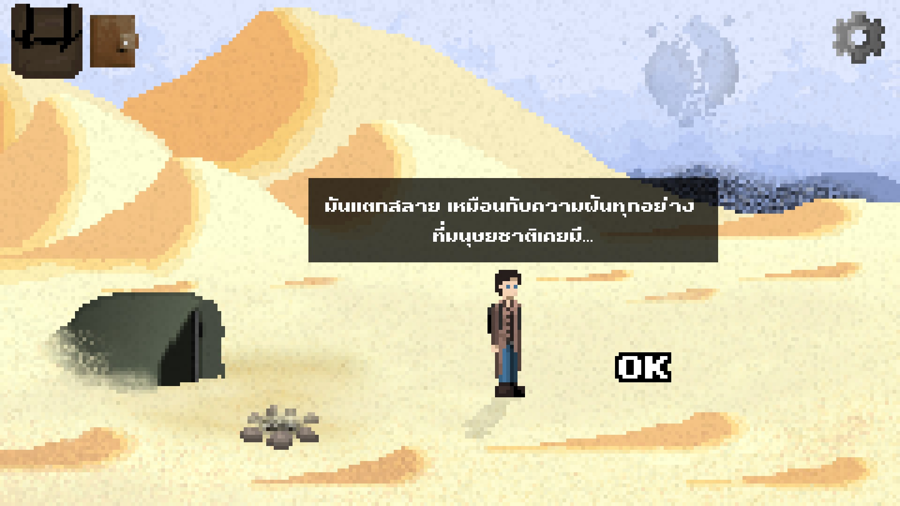
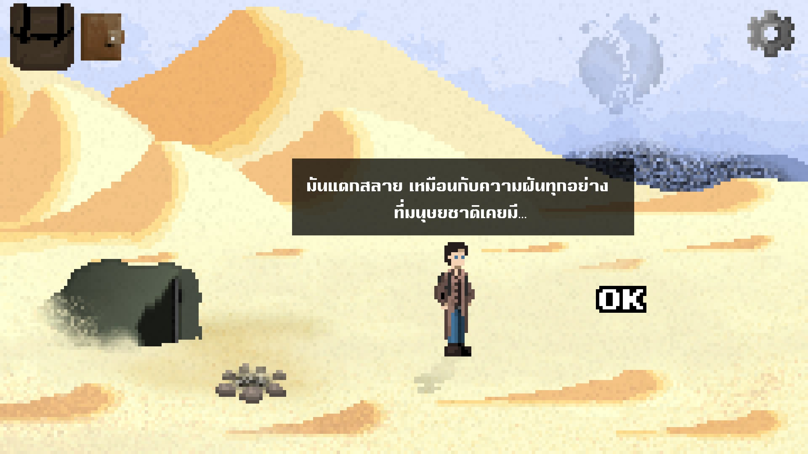
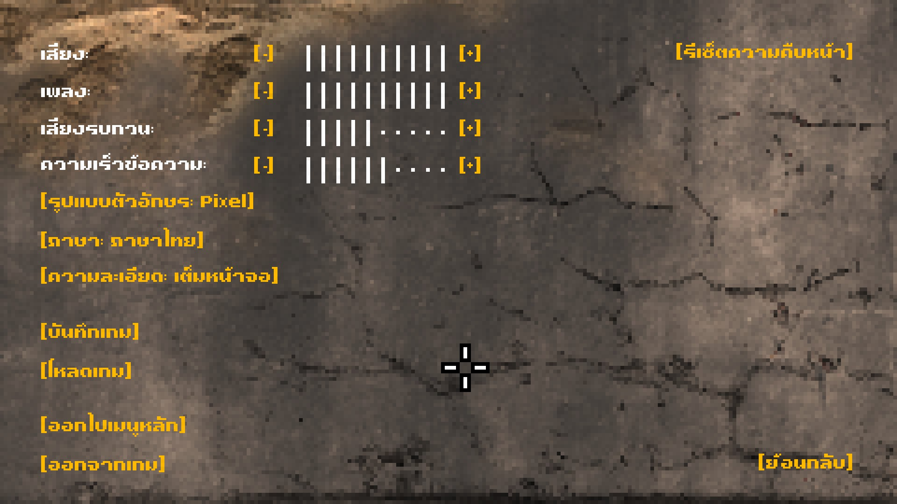
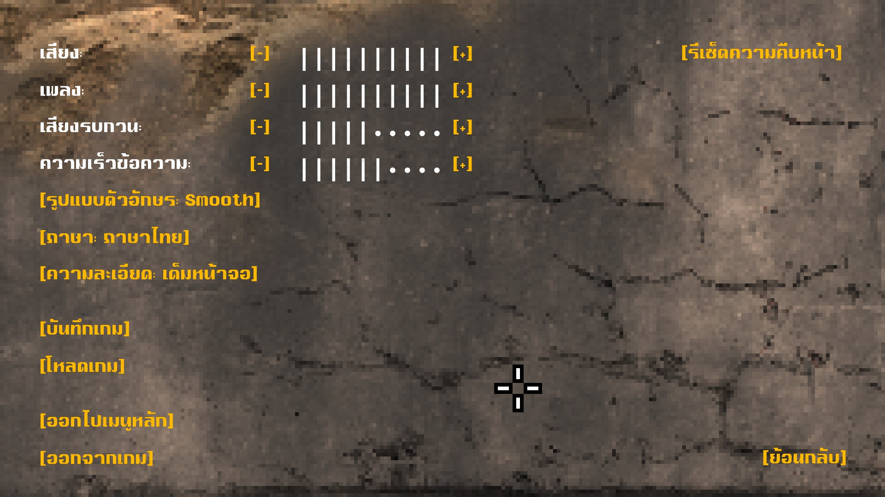

# Don't Escape: 4 Days to Survive — Thai Mod

A Thai localization mod for the Windows version of **Don't Escape: 4 Days to Survive**. It covers menus, UI, dialogue, items, documents, journal entries, puzzle text, New Game+, and supported ending/credits text. Two Thai font modes are included: **Pixel** and **Smooth**.

> **Version 1.0.0** — tested through a complete playthrough and multiple QA passes. Some wording, line breaks, or layouts may still be refined in future updates.

[ภาษาไทย](README.md)

## Release status

- Version: **1.0.0**
- Status: **Initial Public Release**
- Tested platform: **Windows**
- Mod loader: **BepInEx 5.4.23.5 x86**
- Original game: **Required; users must own a legitimate copy**

## Features

- Thai localization for the game's main text and interfaces
- Selectable Pixel and Smooth Thai font modes
- Thai-specific layout handling for documents, journals, popups, and several special scenes
- Coverage for New Game+ and ending content found during testing
- Development diagnostics remain disabled by default

## Screenshots

| Pixel | Smooth |
| --- | --- |
|  |  |

| Pixel options | Smooth options |
| --- | --- |
|  |  |

## Thai font modes

- **Pixel** — matches the game's original pixel-art presentation
- **Smooth** — uses smoother letterforms for easier reading

Switch modes under **Options > Font** while Thai is selected.

## Requirements

- **Don't Escape: 4 Days to Survive** for Windows
- **BepInEx 5.4.23.5 x86 only** — do not use the x64 build

BepInEx and the original game are not included.

## Download and install

Download `DontEscape4Days_ThaiMod_v1.0.0.zip` from the [Releases page](https://github.com/IsAmArt/Don-t-Escape-4-Days-to-Survive-Thai-MOD/releases). Do not use GitHub's automatically generated “Source code” archives; they are not the mod installer.

1. Close the game.
2. Install BepInEx 5.4.23.5 **x86** in the game directory.
3. Copy the ZIP's `BepInEx` folder into the game directory and merge folders.
4. Confirm that these files exist:
   - `BepInEx/plugins/DontEscapeThaiMod/DontEscapeThaiMod.dll`
   - `BepInEx/config/tafo.dontescape4.thai.renderer.cfg`
5. Start the game and choose **Thai** under **Options > Language**.
6. Choose **Pixel** or **Smooth** under **Options > Font**.

When updating, close the game before replacing this mod's files. Save files do not need to be removed.

## Uninstall

Close the game, then remove only:

- `BepInEx/plugins/DontEscapeThaiMod`
- `BepInEx/config/tafo.dontescape4.thai.renderer.cfg`

Do not delete the entire BepInEx folder because other mods may use it.

## Notes

No release-blocking issue was found during the v1.0.0 test pass. Minor wording, line-break, or layout refinements may still be made in later updates.

## Troubleshooting and bug reports

Verify the x86 BepInEx installation, DLL path, and complete `ThaiData` folder. If Windows has blocked the downloaded DLL, review the file's Properties and unblock it according to Windows guidance.

Report problems through [GitHub Issues](https://github.com/IsAmArt/Don-t-Escape-4-Days-to-Survive-Thai-MOD/issues). Include the game, mod, and BepInEx versions, a screenshot, reproduction steps, and `BepInEx/LogOutput.log`. You do not need to enable diagnostics.

## Credits

- Thai Translation / Thai Mod: **IsAmArt / TA Font**
- Thai Font: **TA Font**
- Original game: **Mateusz “Scriptwelder” Sokalszczuk** and the contributors credited in the game
- Publisher: **Armor Games Studios**

See [THIRD_PARTY_NOTICES.md](THIRD_PARTY_NOTICES.md) for dependency and rights notices.

## Rights notice

This is an unofficial fan-made mod and is not affiliated with the game's developer or publisher. The original game, its assets, names, and trademarks belong to their respective owners. See [LICENSE.md](LICENSE.md) for the terms covering the mod code, Thai translation, and Thai font assets.
